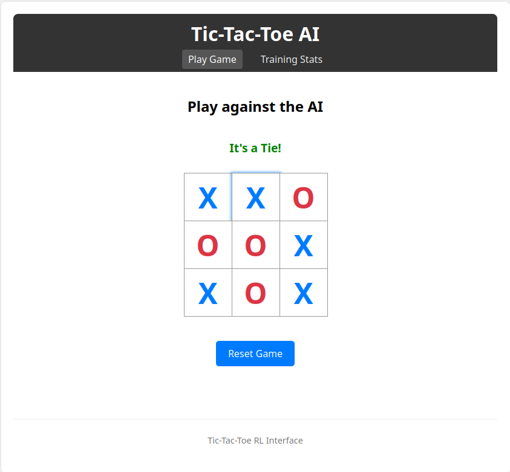
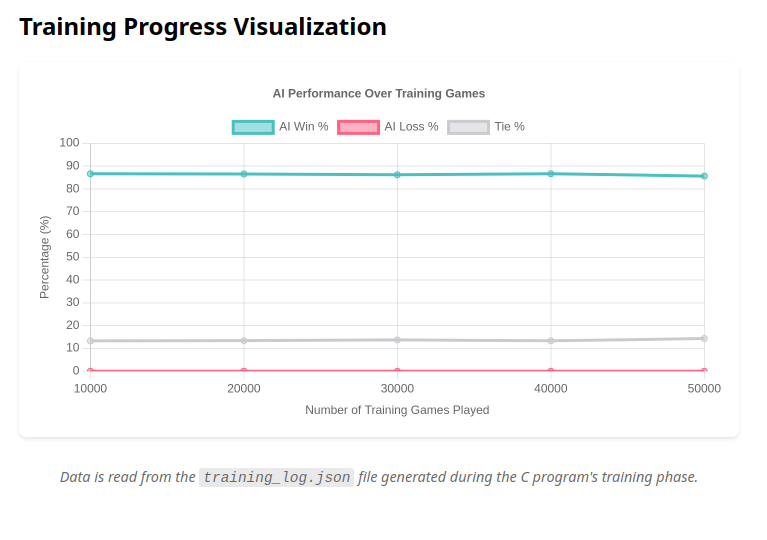

# Tic-Tac-Toe RL (Modified C Program) Documentation

## Overview



This program implements a simple Reinforcement Learning (RL) agent that learns to play Tic-Tac-Toe. It uses a basic neural network trained through self-play against random moves and subsequent interactive play.

This version is based on the original code by Salvatore Sanfilippo (antirez) found at [antirez/ttt-rl](https://github.com/antirez/ttt-rl), but has been modified significantly to facilitate integration with a web-based frontend via a backend server.

If you want to use the WebUI, you can follow [this documentation here](WebUI_Doc.md).

## Key Modifications from Original

The core RL logic and neural network structure remain similar to the original, but several features were added or changed to support external interaction and monitoring:

1.  **Save/Load Neural Network State:**
    *   **Added:** Functions `save_nn()` and `load_nn()` allow persisting the trained neural network's weights and biases to a binary file (default: `ttt_nn.dat`).
    *   **Purpose:** Avoids retraining the network every time the program starts. Essential for deploying a trained agent.
    *   **Control:** Added command-line arguments `--load <filename>` and `--save <filename>` to specify input and output files for the network state.

2.  **Training Progress Logging:**
    *   **Added:** During the training phase (`train_against_random`), the program now logs statistics to a file named `training_log.json`.
    *   **Format:** The log is a JSON array, where each object represents statistics gathered over a fixed interval (currently 10,000 games). Each object includes the cumulative game count (`games`) at the end of the interval, and the number/percentage of wins, losses, and ties *within that specific interval*.
    *   **Purpose:** Allows external visualization (e.g., via a web frontend) of the AI's learning progress over time.

3.  **Enhanced Command-Line Interface (CLI):**
    *   **Modified:** The `main` function now includes more robust argument parsing to control different modes of operation.
    *   **Arguments:**
        *   `--train <num_games>`: Specify the number of games for training against a random opponent (default: 150,000).
        *   `--no-train`: Skip the initial training phase entirely. Useful for playing directly with a pre-trained model.
        *   `--load <filename>`: Load a previously saved neural network from the specified file before training or playing.
        *   `--save <filename>`: Save the neural network to the specified file after training completes.
        *   `--play-ai <board_string>`: **(Crucial for Backend)** A non-interactive mode. Takes a 9-character board string (e.g., `X.O......`) as input, calculates the AI's next move using the loaded network, prints *only* the integer move index (0-8) to standard output (`stdout`), and exits.

4.  **Output Redirection (`stdout` vs `stderr`):**
    *   **Modified:** Informational messages (like "Neural network loaded from...") are now printed to standard error (`stderr`) instead of standard output (`stdout`).
    *   **Purpose:** Keeps `stdout` clean in `--play-ai` mode, ensuring that only the single integer move index is outputted, making it easy for a calling process (like the Node.js backend) to parse the result reliably.

## Compilation

Compile the program using a C compiler (like GCC or Clang), linking the math library:

```bash
cc ttt.c -o ttt -O3 -Wall -W -ffast-math -lm
```

## Usage

The program can be run in several modes using command-line arguments:

**1. Default (Train & Play):**
   Runs the default training (150,000 games), saves the result to `ttt_nn.dat`, logs training to `training_log.json`, and then enters interactive play mode.
   ```bash
   ./ttt
   ```

**2. Custom Training & Save:**
   Train for a specific number of games, save the network to a custom file, log training, and then play interactively.
   ```bash
   ./ttt --train 50000 --save my_model.dat
   ```

**3. Load & Play (No Training):**
   Skip training, load a pre-trained network, and start interactive play immediately.
   ```bash
   ./ttt --no-train --load my_model.dat
   ```
   *(Note: If `my_model.dat` doesn't exist, it will print an error to `stderr` and proceed with an untrained network).*

**4. Backend AI Move Calculation:**
   **This mode is intended for programmatic use (e.g., by the Node.js server).** It loads a network, takes a board state, calculates the AI's move, prints *only* the move index (0-8) to `stdout`, and exits.
   ```bash
   ./ttt --play-ai "X.O......" --load my_model.dat
   ```
   *   Input: The 9-character string represents the board state (`.` for empty, `X`, `O`).
   *   Output (`stdout`): A single integer (e.g., `4`) followed by a newline.
   *   Output (`stderr`): Any informational messages (like "Neural network loaded...").

**5. Combining Arguments:**
   Arguments can be combined, e.g., load a model, train further, save to a different file:
   ```bash
   ./ttt --load old_model.dat --train 100000 --save new_model.dat
   ```

## Generated Files

*   **`ttt_nn.dat`** (or custom name via `--save`): A binary file containing the weights and biases of the trained neural network. Not human-readable.
*   **`training_log.json`**: A JSON file created/overwritten during training (`--train` mode). Contains an array of objects, each detailing statistics (wins, losses, ties, percentages) for consecutive 10,000-game intervals. Used for visualizing learning progress. Example entry:
    ```json
    {
      "games": 10000, // Cumulative games at end of interval
      "wins": 8597,   // Wins within this 10k interval
      "losses": 0,    // Losses within this 10k interval
      "ties": 1403,   // Ties within this 10k interval
      "win_pct": 85.97, // Win % within this 10k interval
      "loss_pct": 0.00, // Loss % within this 10k interval
      "tie_pct": 14.03  // Tie % within this 10k interval
    }
    ```

## Dependencies

*   Standard C Library
*   Math Library (`math.h`) - requires linking with `-lm`.
